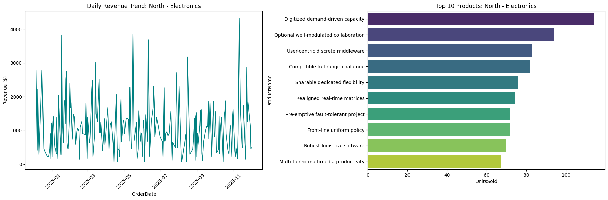
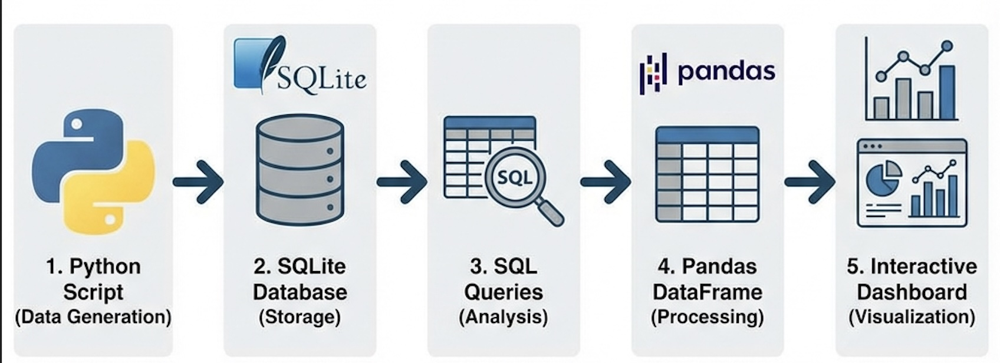
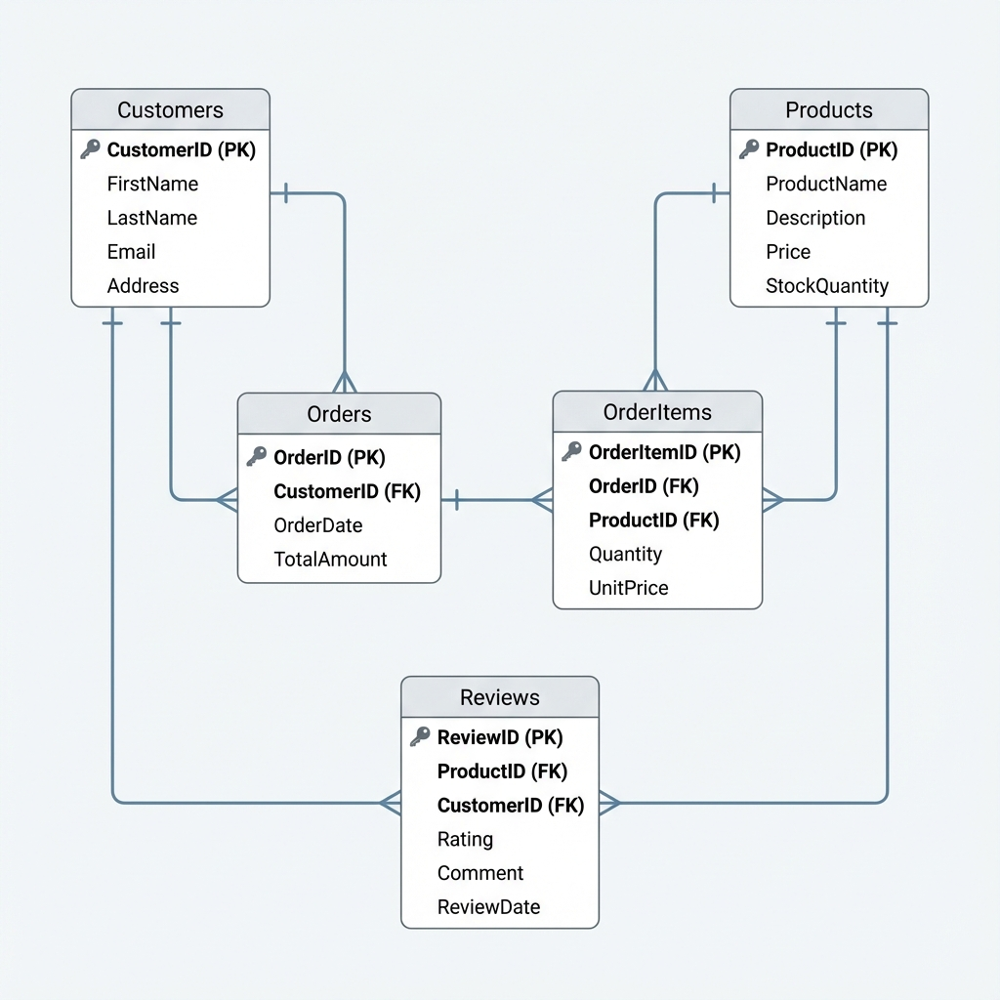

# E-Commerce Inventory & Sales Intelligence Dashboard



A comprehensive interactive database application demonstrating advanced SQL analysis, batch data processing, and dynamic visualization using Python and SQLite.

## 📌 Project Overview
This project simulates a mid-sized online retail store's database system. It handles the full data lifecycle:
1.  **Schema Design**: A normalized 5-table relational schema.
2.  **Data Simulation**: Generation of 5,000+ realistic mock records using `Faker`.
3.  **Advanced Analysis**: Complex SQL queries utilizing Window Functions, CTEs, and Joins.
4.  **Interactive Dashboard**: A user-friendly interface to explore sales trends and product performance.

### System Architecture


## 🗂️ Repository Structure
```
.
├── notebooks/
│   └── interactive_dashboard.ipynb  # Main Application (Google Colab ready)
├── sql/
│   ├── schema.sql                   # Database Schema (DDL)
│   └── queries.sql                  # Analytical Queries
├── assets/                          # Visual Assets
├── data/                            # Database storage (ignored by git)
├── requirements.txt                 # Python dependencies
└── README.md                        # Project Documentation
```

## 📊 Database Schema
The system is built on a robust SQLite schema:
- **Customers**: User profiles and regional data.
- **Products**: Inventory and pricing.
- **Orders**: Transaction headers.
- **OrderItems**: Transaction line items (Many-to-Many link).
- **Reviews**: Customer feedback.



## 🚀 Getting Started

### Option 1: Google Colab (Recommended)
1.  Download `notebooks/interactive_dashboard.ipynb`.
2.  Upload it to [Google Colab](https://colab.research.google.com/).
3.  Run all cells. The notebook handles library installation and data generation automatically.

### Option 2: Local Execution
1.  Clone the repository.
2.  **Create and Activate Virtual Environment** (Recommended):
    ```bash
    # Create virtual environment
    python3 -m venv venv

    # Activate it (Mac/Linux)
    source venv/bin/activate
    # Activate it (Windows)
    # venv\Scripts\activate
    ```
3.  Install dependencies:
    ```bash
    pip install -r requirements.txt
    ```
4.  Run the notebook using Jupyter Lab or Jupyter Notebook:
    ```bash
    jupyter notebook notebooks/interactive_dashboard.ipynb
    ```

### Option 3: Professional Streamlit Dashboard (Recommended)
For the best interactive experience, run the standalone web application:
1.  Ensure dependencies are installed:
    ```bash
    pip install -r requirements.txt
    ```
2.  Launch the dashboard:
    ```bash
    streamlit run streamlit_app.py
    ```
3.  The dashboard will open automatically in your browser at `http://localhost:8501`.

## 📈 Key Features
- **Batch Data Generation**: Efficiently inserts thousands of records using `executemany`.
- **Advanced SQL**:
    - **Ranking**: Identifies top-spending customers per region.
    - **Moving Averages**: Calculates 7-day sales trends.
    - **Aggregations**: Summarizes revenue by category.
- **Professional Interactive Dashboard**:
    - **Powered by Plotly**: High-quality, interactive visualizations.
    - **KPI Cards**: Instant view of Total Revenue, Total Orders, and Avg Order Value.
    - **Dynamic Charts**:
        - Daily Revenue Trend (Zoomable Line Chart).
        - Revenue by Category (Donut Chart).
        - Top 10 Products (Bar Chart).
        - Sales by Day of Week (Bar Chart).
    - **Filtering**: Real-time filtering by Region and Category.

## 🛠️ Technologies
- **Python 3.8+**
- **SQLite3**
- **Pandas & NumPy**
- **Streamlit** (Web App Framework)
- **Plotly & Ipywidgets**
- **Faker**
